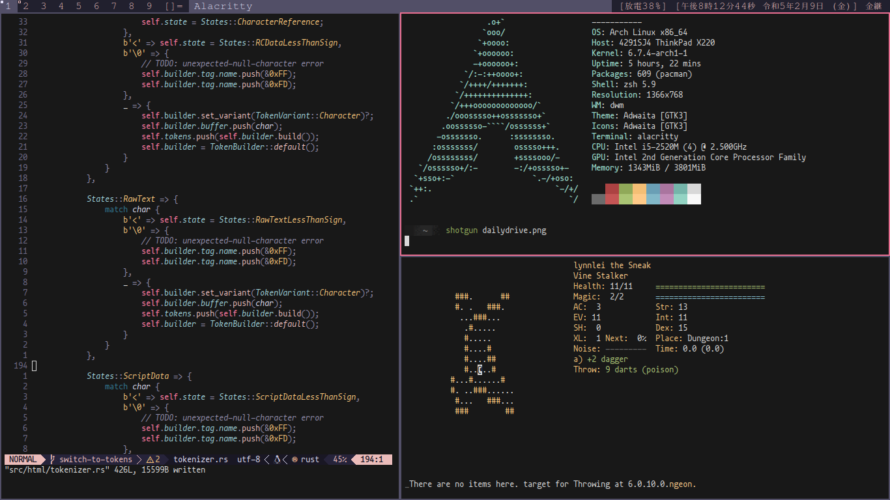

# Hello! I'm Lynn Lei
I've spent 22 years programming, 10 of which are as a professional software engineer.

## Things I Do
- 🦀 professionally work in software development
- 🌐 spend an inordinate amount of time turning the HTML Standard Spec into a browser [@seele](https://github.com/1ynn1ei/seele)
- 📟 play terminal-based games like Dungeon Crawl Stone Soup and Catacylsm: Dark Days Ahead
- 🖲️ obsess over ergonomics
  
## My x220 Setup

## Things I Use & Recommend
| Hardware      | Software |
| ------------- | ------------- |
| ThinkPad x220 i5 | arch linux |
| Ergodox-EZ  | dwm & dmenu  |
| Olympia SM9 | neovim |
| Lamy Safari | alacritty |

## Things I Am Interested In
- writing interpreters, parsers, lexers, and disasemblers
- steps to improve accessibility in software that i write
- optimizing my setup to push old hardware as far as it can go
- finding ways to reduce my own consumption of electricity in electronics & software
- never touching a mouse again in my life
- contributing to more projects

## Future Projects
- writing a file-based MUD client, allowing for tmux setups that can better reproduce modern GUI clients
- getting sound to work in terminal-mode games, such as C:DDA
